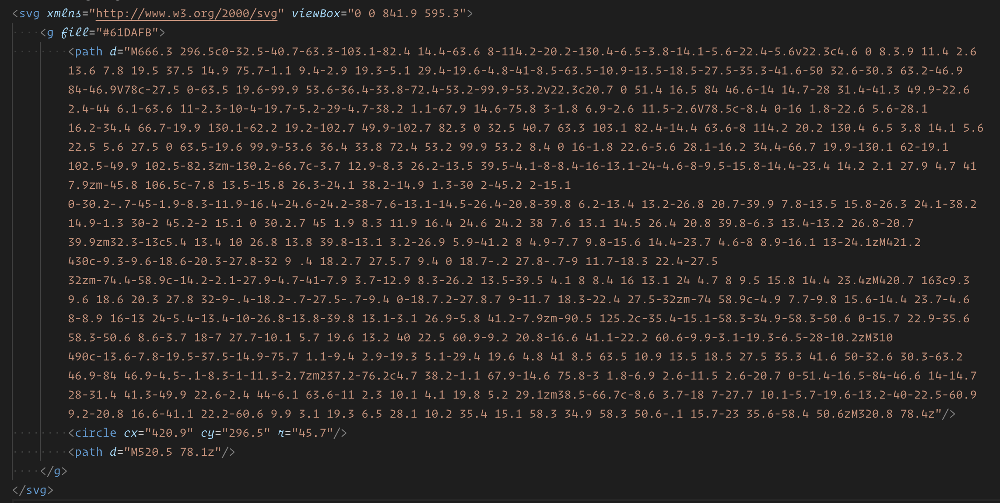
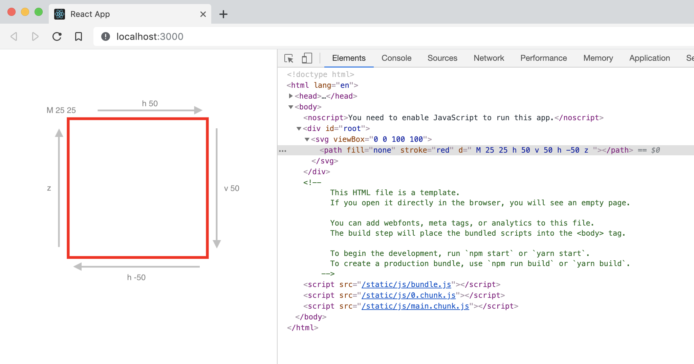

import Chart from './components/demo-chart/';

<Chart />

# The approach
Our component will render a slightly more complicated version of this:

```html
<svg>
	<path />
	<path />
	<path />
</svg>
```

We’ll render an `<svg>` container and one `<path>` element for each value to draw the chart segments.

Don’t worry if you’ve never worked with the guts of SVG before. There are only a few things you need to know and I’ll try to explain them along the way.

# Project setup
There’s a bit of setup and tooling required for React projects so to get set up I’m going to use [`create-react-app`](https://github.com/facebook/create-react-app) to establish a starting point.[^1]

Open a terminal and run the following command to create the project.[^2]

```bash
npx create-react-app donut-chart
```

When it finishes you should have a `donut-chart` directory with a working React app. Navigate into the directory and launch the app with yarn: [^3]

```bash
cd donut-chart
yarn start
```

Your browser should open to show the React starter app.


# Add a DonutChart component
Let’s stub out our DonutChart component.

For now, the DonutChart component will render an empty `<svg>` element with a `viewBox` attribute. The `viewBox` establishes the SVG’s coordinate space. Setting it to `0 0 100 100` gives us a canvas 100 units tall and wide, with the top-left corner at (0, 0) and bottom-right at (100, 100). [^4]

I’ve added a `values` prop declaration that expects an array of objects, each with a numeric`value` property. [^5]

```js
// src/donut-chart/DonutChart.jsx

import React from 'react';
import PropTypes from 'prop-types';

export default class DonutChart extends React.Component {
	static propTypes = {
		values: PropTypes.arrayOf(
			PropTypes.shape({
				value: PropTypes.number.isRequired
			})
		)
	}

	render () {
		return (
			<svg viewBox="0 0 100 100">

			</svg>
		);
	}
}
```
# Add a View component

We can’t render a chart without data, so let’s create a `View` component to pass data to our chart.

```js
// src/donut-chart/View.jsx

import React from 'react';

import DonutChart from './DonutChart';

export default class DonutView extends React.Component {
	render () {
		return (
			<DonutChart />
		);
	}
}
```

And update `App.js` to render our View instead of the React boilerplate.

```js
// src/App.js

import React from 'react';

import View from './donut-chart/View';

function App() {
  return (
    <View />
  );
}

export default App;

```

Save and refresh your browser and you’ll see… a blank page. Our SVG isn’t drawing anything yet. But if you open the browser’s dev tools you should see it in the DOM:


# Add mock data

Let’s mock out some data and pass it to the chart. For now we’ll hard-code it into the View component.

```js
// src/donut-chart/View.jsx

import React from 'react';

import DonutChart from './DonutChart';

const values = Array.from(
	{length: 5},
	() => ({value: Math.floor(Math.random() * 100)})
);

export default class DonutView extends React.Component {
	render () {
		return (
			<DonutChart values={values} />
		);
	}
}
```
# Generating data with Array.from

I’ll unpack the `values` declaration since it’s using the relatively new language features [Array.from](https://developer.mozilla.org/en-US/docs/Web/JavaScript/Reference/Global_Objects/Array/from) and [arrow functions](https://developer.mozilla.org/en-US/docs/Web/JavaScript/Reference/Functions/Arrow_functions) which may be unfamiliar. Feel free to skip this section if you already understand what’s happening here.

```js
const values = Array.from(
	{length: 5},
	() => ({value: Math.floor(Math.random() * 100)})
);
```

`Array.from` creates an array from an “array-like” object, which happens to include anything with a numeric`length`.[^6]

Passing an object literal `{length: 5}` to `Array.from` returns an 5-item array filled with `undefined`:

```js
Array.from({length: 5})

// [undefined, undefined, undefined, undefined, undefined]
```

`Array.from` takes an optional second argument: a map function to be called for each item in the new array. The function receives the item’s initial value and its index, providing a concise means of generating a populated array of any length:

```js
function mapFn (value, index) {
	return index * 2;
}

Array.from({length: 5}, mapFn);

// [0, 2, 4, 6, 8]
```

We can rewrite `mapFn` as a terse inline [arrow function](https://developer.mozilla.org/en-US/docs/Web/JavaScript/Reference/Functions/Arrow_functions):

```js
Array.from(
	{length: 5},
	(value, index) => index * 2
);

// [0, 2, 4, 6, 8]
```

For our purposes we don’t care about the value[^7] or index parameters. We just want some arbitrary values. So we can lose the arguments and return random numbers:

```js
Array.from(
	{length: 5},
	() => Math.random()
);

// [0.9827377552249277, 0.07409193982747175, 0.8118452013993722, 0.9608580064232424, 0.1436456585838004]
```

Random numbers between 0 and 100:

```js
Array.from(
	{length: 5},
	() => Math.random() * 100
);

// [46.73939526991666, 97.6077039964036, 35.75426143372671, 20.059091655726725, 63.3944367327995]
```

And use `Math.floor` to turn them into integers:

```js
Array.from(
	{length: 5},
	() => Math.floor(Math.random() * 100)
);

// [43, 26, 64, 90, 15]
```

And finally, we want objects, not just numbers. So instead of returning the integers we’ll return an object literals with a `value` property[^8].

```js
Array.from(
	{length: 5},
	() => ({
		value: Math.floor(Math.random() * 100)
	})
);

/*
[
  { value: 32 },
  { value: 5 },
  { value: 52 },
  { value: 7 },
  { value: 13 }
]
*/
```
# generating an SVG donut chart with javascript 
* create SVG, include viewBox
* compute percentages from an array of values
* add a path element for each value to draw the segment

# SVG Path Basics
Now that we have it all set up we can get to the fun part: drawing stuff.

We’ll render each chart segment with an SVG `<path>` element. Path elements may appear daunting at first due to their terse syntax—a cryptic and usually long sequence of letters and numbers—but it’s not as complicated as it looks. It’s a few variations of a single idea, repeated as necessary to draw a shape.



According to [MDN](https://developer.mozilla.org/en-US/docs/Web/SVG/Element/path):

> The \<path\> SVG element is the generic element to define a shape. All the basic shapes can be created with a path element.

The [`d` attribute](https://developer.mozilla.org/en-US/docs/Web/SVG/Attribute/d) of a path element defines the path to be drawn. Its value is

> a list of [path commands](https://developer.mozilla.org/en-US/docs/Web/SVG/Attribute/d#Path_commands) where each command is composed of a command letter and numbers that represent the command parameters.

SVG defines 6 types of path commands. We’ll be using 4 of them[^9].

* [MoveTo](https://developer.mozilla.org/en-US/docs/Web/SVG/Attribute/d#MoveTo_path_commands "MoveTo command reference at MDN") (M, m)
* [LineTo](https://developer.mozilla.org/en-US/docs/Web/SVG/Attribute/d#LineTo_path_commands "LineTo command reference at MDN") (L, l, H, h, V, v)
* [Arc](https://developer.mozilla.org/en-US/docs/Web/SVG/Attribute/d#Elliptical_Arc_Curve "Elliptical Arc Curve reference at MDN"): (A, a)
* [ClosePath](https://developer.mozilla.org/en-US/docs/Web/SVG/Attribute/d#ClosePath "ClosePath command reference at MDN"): (Z, z)

The path commands are [explained in detail at MDN](https://developer.mozilla.org/en-US/docs/Web/SVG/Attribute/d#Path_commands "Path command reference at MDN") and I encourage you to read up on them over there, but they all take the same fundamental form: a single letter specifying the command, followed by one or more numbers as parameters to the command.[^10]

The MoveTo and LineTo commands take x and y coordinates, for example:
`M 50 50` to move to (50, 50), `L 25 65` to draw a line to (25, 65), and so on.

String these commands together and you can draw virtually any shape.

The uppercase versions operate in absolute coordinates while the lowercase operate in relative coordinates. `L 25 25` (uppercase L) draws a line to (25, 25) in the SVG coordinate space (25 pixels right and down from the origin), whereas `l 25 25` (lowercase L) draws a line 25 pixels right and down _from the current position_.

The `H` and `V` variants of LineTo are shorthand for drawing horizontal and vertical lines with a single parameter. `h 30` draws a horizontal line 30 units to the right, for example.

To see how this works, add a `<path>` element to the donut chart component that draws a square:

```
<svg viewBox="0 0 100 100">
	<path fill="none" stroke="red"
		d="
			M 25 25
			h 50
			v 50
			h -50
			z
		"
	/>
</svg>
```

The path commands do the following:
* `M 25 25` - Move to (25, 25) to begin the path at the upper left corner of the box.
* `h 50` - Draw a horizontal line to the right, 50 units long.
* `v 50` - Draw a vertical line, downward, 50 units long.
* `h -50` - Draw a horizontal line 50 units to the left.
* `z` - Close the path by drawing a line back to the start point (25, 25).



Arcs require more parameters, but it’s the same idea, the same format.

# Two approaches
My first attempt at this involved drawing a simple stroked arc for each chart segment, using the stroke to establish color and thickness. This approach had a couple of shortcomings and I ended up taking a different route. I’m including the first approach to illustrate my thinking and demonstrate the rationale for the second. Feel free to skim the first approach if you’re in a hurry.

# First approach: stroked arc
* Drawing the segments
	* compute the angle - (percentage of 360°)
	* compute the start point and end point for the arc - sin(angle) x radius, cos(angle) x radius
		* using the pythagorean theorem to compute coordinates for a known angle and radius
			* sin/cos - ratio of x:y for the angle - cos for x, sin for y
			* multiply by radius to get coordinate
	* create a `<path>` element
		* basics of path commands
	* add `M` (move) command to move to the start coordinate
		* move command explanation
	* add `A` (arc) command to create an arc to the end point
		* arc command parameters explanation
	*  repeat for next value, offsetting the angle so it starts where this one ends

# Drawing the arcs
For each value we need to do the following:
1. Compute the percentage the value represents
2. Compute the angle for that percentage (how much of the chart’s 360° should this segment occupy?)
3. Compute coordinates for start and end points for an arc for that angle, offset (rotated) to begin where the previous segment ended.
4. Render a `<path>` element that moves to the start coordinate and draws an arc to the end coordinate.

# Compute the percentages
Let’s add a method to our `DonutChart` component to compute the percentage for each value:

1. Filter out any zero values.
2. Sum the values to get the total.
3. Divide each value by the total to get the percentage for that value.
4. Return a copy of the values with a percentage property added to each value object for convenient access.

```js
computePercentages () {
	const {values} = this.props;

	// filter out zero and negative values
	const filtered = (values || []).filter(({value}) => value > 0);

	// compute the total of all remaining values
	const total = filtered.reduce((t, {value = 0}) => t + value, 0);

	// return the values with an additional percentage property
	return filtered.map(item => ({
		...item,
		percent: item.value / total
	}));
}

/*

if this.props.values is:

[
  { "value": 75 },
  { "value": 30 },
  { "value": 16 },
  { "value": 94 },
  { "value": 78 }
]

this.computePercentages() returns:

[
  { "value": 75, "percent": 0.25597269624573377 },
  { "value": 30, "percent": 0.10238907849829351 },
  { "value": 16, "percent": 0.05460750853242321 },
  { "value": 94, "percent": 0.32081911262798635 },
  { "value": 78, "percent": 0.26621160409556316 }
]

*/
```
# Compute the angles
We need to compute a few angles for each item to draw their respective paths:

1. An angle representing the size of the segment in the chart; what percentage of the available 360° the item occupies.
2. A start angle indicating where the segment should begin in order to align it with the end of the previous segment.
3. The end angle for the segment, which is simply the sum of the angles above. (We’ll pre-compute this just as a convenience for finding the start angle of the item that follows.)

To keep things simple, we’ll compute these in advance before passing everything to a path-rendering method[^11]. 

We’ll use [Array.reduce](https://developer.mozilla.org/en-US/docs/Web/JavaScript/Reference/Global_Objects/Array/reduce) to add the angles.

Add a `computeAngles` method for the `reduce`:

```js
computeAngles (acc, item) {
	// how much of the circle does this segment occupy?
	const angleDeg = item.percent * 360;

	// use the previous item's end angle as this item's start angle
	const {endAngle: startAngle = 0} = acc[acc.length - 1] || {};

	// end angle is just the sum of the other two
	const endAngle = startAngle + angleDeg;

	// add the angles to the item and add it to the results array
	acc.push({
		...item,
		angleDeg,
		startAngle,
		endAngle
	});

	// return for the next iteration
	return acc;
}

```
# Render the \<path\>s

```js
makePath = ({angleDeg, startAngle, endAngle}, i) => {
	const [startX, startY] = coords(startAngle, radius);
	const [endX, endY] = coords(endAngle, radius);

	const largeArc = angleDeg > 180 ? 1 : 0;
	const sweep = 1; // clockwise

	const commands = [
		`M ${startX} ${startY}`,

		// (rx ry angle large-arc-flag sweep-flag x y)+
		`A ${radius} ${radius} ${angleDeg} ${largeArc} ${sweep} ${endX} ${endY}`
	];

	return (
		<g key={i}>
			<path key={i} fill="none" stroke="red" d={commands.join(' ')} />
			<circle key={`c${i}`} fill="red" r="2" cx={endX} cy={endY} />
		</g>
	);
}
```
# applying color: fill, stroke, stroke-width
* Using styling attributes on the path element:
	* set `fill="none"` attribute on the path
	* set a `stroke-width` attribute on the path element at the desired size
	* set a `stroke` attribute to specify the stroke color
* Using CSS:
	```css
		path {
		  fill: none;
		  stroke: red;
		  stroke-width: 12px;
		}
		```
# Color cycling with CSS
* using `nth-child` to cycle through a color palette
	* nth-child primer
```css
	.pie-chart-segment:nth-child(3n + 1) {
		fill: red;
	}

	.pie-chart-segment:nth-child(3n + 2) {
		fill: green;
	}

	.pie-chart-segment:nth-child(3n + 3) {
		fill: blue;
	}
```
# Adding gaps
* offset the angles
	* start angle + 1°, end angle - 1°

# Problems:
* small values get swallowed by the gaps
	* omit gaps for values \< gap size x 2
* gap is wedge shaped, larger at the outside edge
	* fix by drawing shapes instead of stroked arc

# Second approach: filled shapes
*  choose an inner radius and outer radius
*  drawing the shapes:
	* compute the angle (as before)
	* compute four coordinates for the segment (using technique described above):
		* start point and end point for inner-radius arc
		* start point and end point for outer-radius arc
	* create a `<path>`element (as before)
	* add `M` (move) command to the inner-radius start point
	* add `L` (line) command to the outer-radius start point
	* add `A` (arc) command to the outer radius end point
	* add `L` (line) command to the inner-radius end point
	* add `A` (arc) command back to the inner radius start point, closing the shape.

# Adding gaps
* offsetting the angles by the same amount (e.g. 1°) when computing the inner and outer coordinates will result in the same problem as before: wedge-shaped gaps.
* we need to compute the angle/offset that will produce an arc the size of our desired gap at the inner radius, and again for the same length at the outer radius
```js
	angleForArcLength = (arcLength, atRadius) => arcLength / atRadius;`
```
	* how/why this works
* Add the offsets to the coordinate calculations
	* start angle inner + offset inner
	* start angle outer + offset outer
	* end angle outer - offset outer
	* end angle inner - offset inner
* Problems
	* small values swallowed by gaps
		* omit gaps for values \< inner gap offset
			```js
				**
				 * The minimum angle that won't be swallowed by the gap offsets at the inner edge.
				 * Used to compute the minimum value that won't get swallowed (minimumValue defined below)
				 */
				const minimumAngleDeg = r2d(angleForArcLength(gapSize * 2, radiusInner));

				/**
				 * The minimum value that won't get swallowed by the gap offsets at the inner edge
				 */
				const minimumValue = minimumAngleDeg / 360;
				```
# conclusion/review/wrap-up

[^1]:	I’m using [React](https://reactjs.org "React") here, but the technique I’m describing does not require it. One could easily do this with plain javascript using [createElement](https://developer.mozilla.org/en-US/docs/Web/API/Document/createElement) and [appendChild](https://developer.mozilla.org/en-US/docs/Web/API/Node/appendChild).

[^2]:	There’s also a `create-react-app` template on [Code Sandbox](https://codesandbox.io) if you prefer to go that route. It lets you get a React project up and running with a single click.

[^3]:	You could also use `npm start`. I’m using yarn here mostly because that’s what `create-react-app` uses.

[^4]:	This could be whatever size we want, but 100x100 makes it easy to think about in percentages. The center of our graphic is at (50, 50), for example.

[^5]:	We could use an array of numbers here; using objects anticipates the need for additional data associated with the value. A label, for example.

[^6]:	[https://www.ecma-international.org/ecma-262/6.0/#sec-array.from](https://www.ecma-international.org/ecma-262/6.0/#sec-array.from)

[^7]:	which will always be `undefined` in this case anyway

[^8]:	The parenthesis around the object literal are required here. Without them the curly braces would be interpreted as the body of the arrow function, not a return value.

[^9]:	The other two are [ Cubic Bézier Curve ](https://developer.mozilla.org/en-US/docs/Web/SVG/Attribute/d#Cubic_B%C3%A9zier_Curve "Cubic Bézier Curve command reference at MDN") and [ Quadratic Bézier Curve ](https://developer.mozilla.org/en-US/docs/Web/SVG/Attribute/d#Quadratic_B%C3%A9zier_Curve "Quadratic Bézier Curve command reference at MDN").

[^10]:	Except in the case of the ClosePath command, `z`, which requires no parameters.

[^11]:	We could do this as part of `computePercentages` but keeping it separate makes it easier to follow.